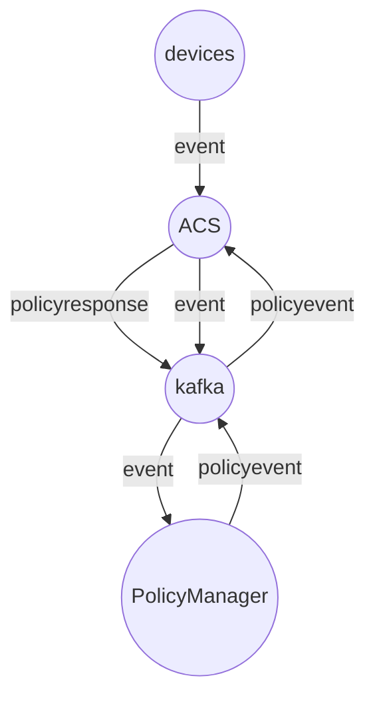

# acs
This is a component of an ACS server. It can handle the actual session with a device.

# Flow

## External influences

### Device connection
A device should be able to connect to this component, delivering it's event information, i.e. Inform with events in the CWMP case.

### Queue
Access to the queing system where operations for this device is placed. If a queue has contents, handle at once and then signal the configuration controller and start a timer. This gives the core controller a chance to put new stuff into the queue which will be handled before the timeout when the session will be closed. The core controller should send a response that indicates whether something is going to arrive in the queue or not, allowing us to close the session immediately on "no content". If the core has content incomming, we wait until the timeout or the end of the queue before terminating the session.

### Session initiation
The action of making a device initiate a new session is left to other components.

