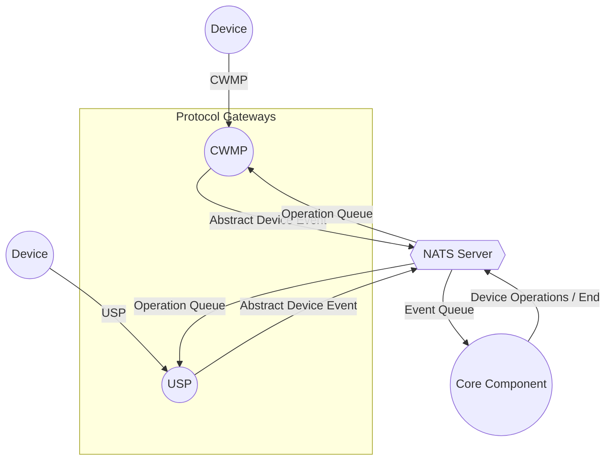
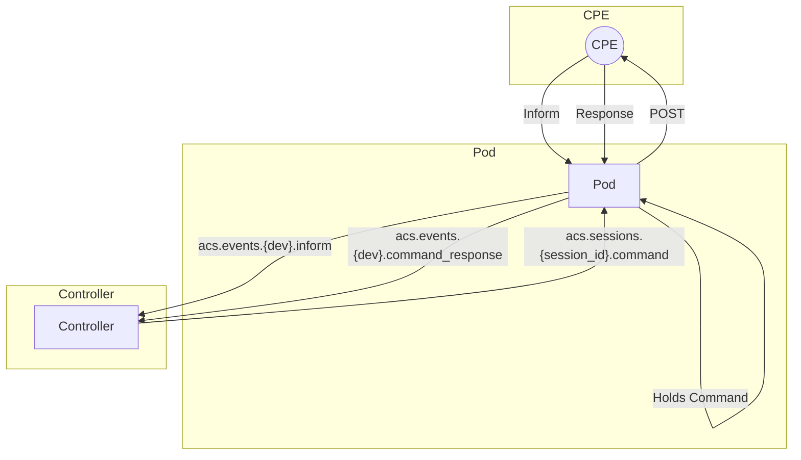

# acs
The project is built around the idea of an ACS server, which is used to manage devices.

## Diagrams

```mermaid
flowchart TD;
    subgraph Protocol Gateways
        cwmp((CWMP))
        usp((USP))
    end
    
    dev1((Device)) -- CWMP --> cwmp
    dev2((Device)) -- USP --> usp
    
    nats{{NATS Server}}
    
    cwmp -- Abstract Device Event --> nats
    usp -- Abstract Device Event --> nats
    
    core((Core Component))
    
    nats -- Event Queue --> core
    core -- Device Operations / End --> nats
    
    nats -- Operation Queue --> cwmp
    nats -- Operation Queue --> usp
```

## Components

The project consists of the following components:

- **cwmp**: The CWMP component, which is responsible for managing CWMP devices. It implements the CWMP protocol.
- **usp**: The USP component, which is responsible for managing USP devices. It implements the USP protocol.
- **nats**: The NATS component, which is responsible for the communication between components of the ACS server.

## External influences

### Device connection
A device should be able to connect to this component, delivering it's event information, i.e. Inform with events in the CWMP case.

### Queue
Access to the queuing system where operations for this device is placed. If a queue has contents, handle at once and then signal the configuration controller and start a timer. This gives the core controller a chance to put new stuff into the queue which will be handled before the timeout when the session will be closed. The core controller should put an "end" message in the queue when the session should be closed, i.e. a message that says "no more operations are going to be sent in this session".

#### NATS subject design ####

##### Pod → Controller (Events)

- acs.events.{oui}.{serial}.inform
- acs.events.{oui}.{serial}.command_response
- acs.events.{oui}.{serial}.session_ended

Controller subscribes to acs.events.>. The device identity is baked into the subject, giving you per-device filtering and natural ordering with JetStream.

##### Controller → Pod (Commands)

- acs.sessions.{session_id}.command

Each pod subscribes only to its own session's subject after the Inform. The session_id is the routing key that pins commands to the right pod.

##### Full Flow

```mermaid
flowchart TD;
    subgraph CPE
        dev1((CPE))
    end
    
    subgraph Pod
        pod1[Pod]
    end
    
    subgraph Controller
        controller[Controller]
    end
    
    dev1 -- Inform --> pod1
    pod1 -- acs.events.{dev}.inform --> controller
    controller -- acs.sessions.{session_id}.command --> pod1
    pod1 -- Holds Command --> pod1
    pod1 -- POST --> dev1
    dev1 -- Response --> pod1
    pod1 -- acs.events.{dev}.command_response --> controller
```

Use JetStream for the event stream.
For the `acs.events.>` side, use a JetStream stream (e.g. ACS_EVENTS) so the controller gets:

- Guaranteed delivery even if it restarts
- Replay for debugging
- Exactly-once processing with consumers

The `acs.sessions.{session_id}.command` side can stay as plain core NATS (no persistence needed — the session is live, and if the pod dies the session dies too).

### Session initiation
The action of making a device initiate a new session is left to other components.