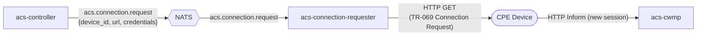

# acs-connection-requester

A small, focused microservice that **wakes sleeping devices** on demand.

When a device is not in an active CWMP session, `acs-controller` cannot push commands to it directly. Instead, the controller publishes a connection-request message to NATS, and this service picks it up and sends the HTTP GET that causes the device to initiate a new session.

## Flow



## Why a separate service?

Isolating the HTTP GET into its own process means:

- `acs-controller` stays pure Rust async without blocking on outbound HTTP calls to potentially slow or unreachable devices.
- The connection requester can be scaled, rate-limited, or replaced independently.
- Credentials (username/password for digest auth) never need to leave this service.

## NATS subject

`acs.connection.request`

Payload (JSON):

```json
{
  "device_id":             "AABB00-1234567",
  "connection_request_url":"http://192.168.1.10:7547/connection",
  "username":              "acs",
  "password":              "secret"
}
```

`username` and `password` are optional. If both are present, HTTP Basic Auth is used.

## Configuration

| Env var | Default | Description |
|---------|---------|-------------|
| `NATS_URL` | `nats://localhost:4222` | NATS server URL |

## Running

```bash
NATS_URL=nats://localhost:4222 cargo run -p acs-connection-requester
```
