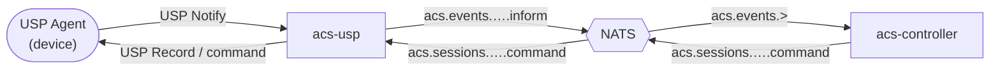

# acs-usp

USP (User Services Platform) protocol gateway for the ACS platform — the TR-369 counterpart to `acs-cwmp`.

> **Status: placeholder.** The groundwork (Cargo crate, NATS wiring) is in place. Protocol implementation is planned for a future iteration.

## Responsibility

When implemented, `acs-usp` will:

- Accept USP Notify messages from USP Agents (devices) over MQTT, WebSocket, or STOMP.
- Normalise them into the same abstract event payload that `acs-cwmp` already publishes to NATS.
- Subscribe to `acs.sessions.{session_id}.command` and translate `Action` objects into USP Records sent back to the agent.

## Flow (planned)

## NATS subjects (shared with acs-cwmp)

| Direction | Subject | Description |
|-----------|---------|-------------|
| USP → Controller | `acs.events.{oui}.{serial}.inform` | Device announced itself |
| USP → Controller | `acs.events.{oui}.{serial}.command_response` | Response to a command |
| USP → Controller | `acs.events.{oui}.{serial}.session_ended` | Session closed |
| Controller → USP | `acs.sessions.{session_id}.command` | Action to deliver to device |

## Configuration (planned)

| Env var | Default | Description |
|---------|---------|-------------|
| `NATS_URL` | `nats://127.0.0.1:4222` | NATS server URL |
| `LISTEN_ADDR` | `0.0.0.0:5683` | CoAP / MQTT / WebSocket listen address |
