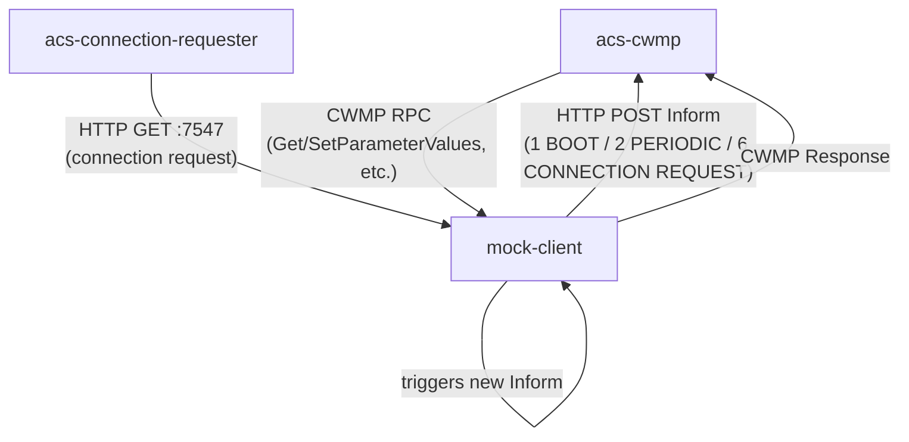
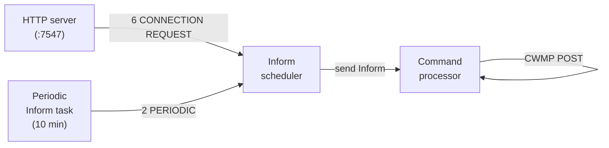

# mock-client (cpe-mock-client)

A self-contained **CWMP CPE simulator** used for local development and integration testing. It behaves like a real TR-069 device: it boots, sends Informs, listens for connection requests, and responds to ACS commands — all without any physical hardware.

## What it does

| Behaviour | Detail |
|-----------|--------|
| **Boot Inform** | Sends a `1 BOOT` Inform to the ACS URL on startup |
| **Periodic Inform** | Sends a `2 PERIODIC` Inform every 10 minutes |
| **Connection Request listener** | Exposes an HTTP server on `CPE_LISTEN_PORT` (default `7547`); a GET to this endpoint triggers a `6 CONNECTION REQUEST` Inform |
| **GetParameterValues** | Returns values from its in-memory parameter store |
| **SetParameterValues** | Applies values to its in-memory parameter store |
| **GetParameterNames** | Returns a fixed set of TR-181 parameter paths |

## Flow



## Internal architecture



Three async tasks run concurrently, communicating via Tokio MPSC channels:

| Task | Role |
|------|------|
| `send_periodic_inform_task` | Fires a `2 PERIODIC` Inform every 10 minutes |
| `inform_scheduler_task` | Drains the inform queue and sends each Inform to the ACS |
| `process_command_task` | Handles ACS responses: routes Get/Set/Names RPCs and empty POSTs |

## Parameters exposed

The simulator maintains an in-memory TR-181 parameter store (see [`device_info.rs`](src/device_info.rs)) populated from `device_data.json` at startup:

```
Device.DeviceInfo.Manufacturer
Device.DeviceInfo.HardwareVersion
Device.DeviceInfo.SoftwareVersion
Device.ManagementServer.URL
Device.ManagementServer.ConnectionRequestURL
Device.ManagementServer.ParameterKey
```

## Configuration

| Env var | Default | Description |
|---------|---------|-------------|
| `CPE_LISTEN_PORT` | `7547` | Port for the connection-request HTTP listener |
| `RUST_LOG` | — | Log level (`debug`, `info`, `error`) |

The ACS URL and device identity are read from `device_data.json` in the working directory.

## Running

```bash
# From the repo root
RUST_LOG=info cargo run -p cpe-mock-client

# With debug logging
RUST_LOG=debug CPE_LISTEN_PORT=7548 cargo run -p cpe-mock-client
```
